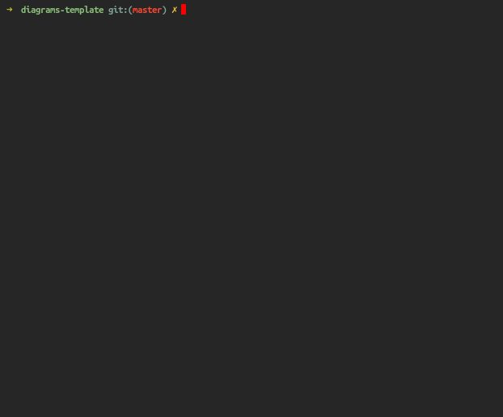

# Diagrams Template

This is a simple template for making [Diagrams](https://diagrams.mingrammer.com/).

## Organization

Diagrams python files must be placed in `src/`. It is recommended, but not required, to place images in `img`. This can be done by setting the `filename` attribute in the `Diagram` object as below:

```python
with Diagram('Grouped Workers', show=False,
                                direction='TB',
                                filename='img/example'):
    ELB('lb') >> [EC2('worker1'),
                  EC2('worker2'),
                  EC2('worker3'),
                  EC2('worker4'),
                  EC2('worker5')] >> RDS('events')
```

## Running

The only dependencies needed are having `bash` and `docker` installed. All `Diagrams` dependencies are managed in a Docker container, therefore trying multi-platform support out-of-the box.

To build the images according to the diagrams file, all you need to run is:

```bash
./make-diagrams
```



## Catches

The `make-diagrams` script is pretty clear on the approach to assure multi-platform support. **BUT** noto that it assumes on line `9` that your system has a `/tmp` directory which is used to cache [poetry](https://python-poetry.org/) Python dependencies. I'm not sure if this is supported in systems like Windows, or other non-Unix systems; but I didn't have the opportunity to test it. Please double check and adapt it to your system if necessary.